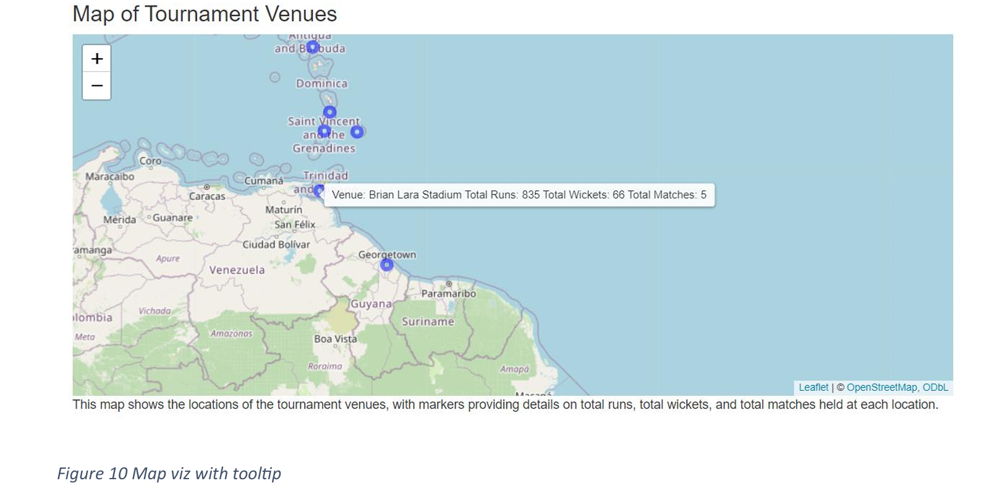
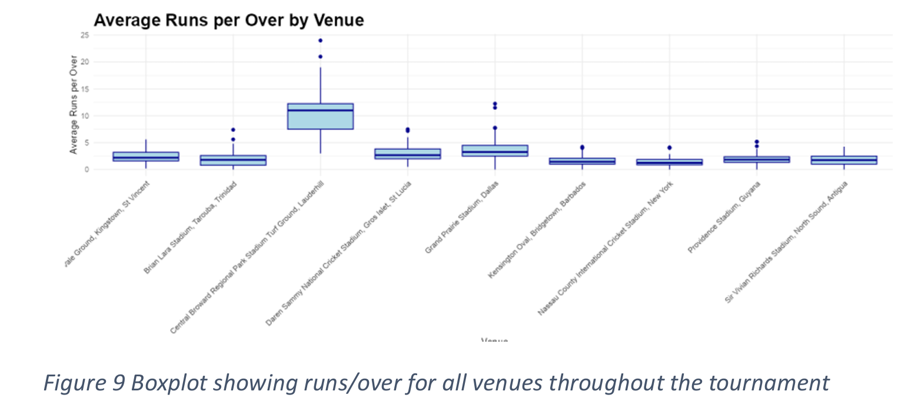
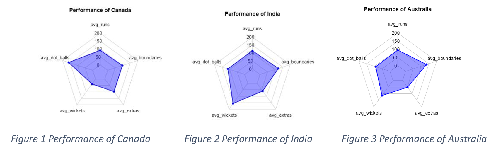
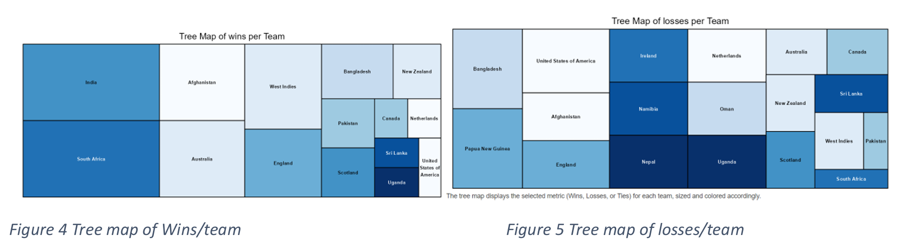
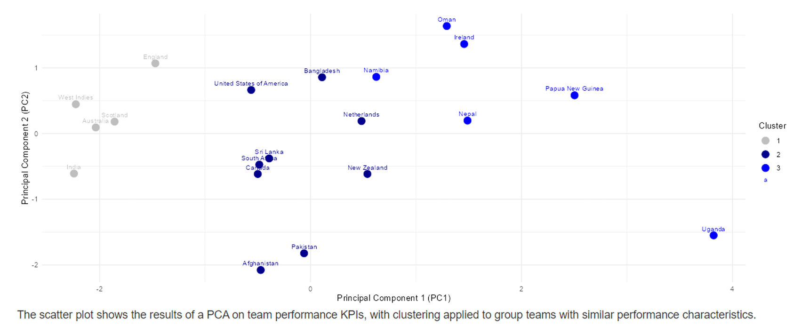
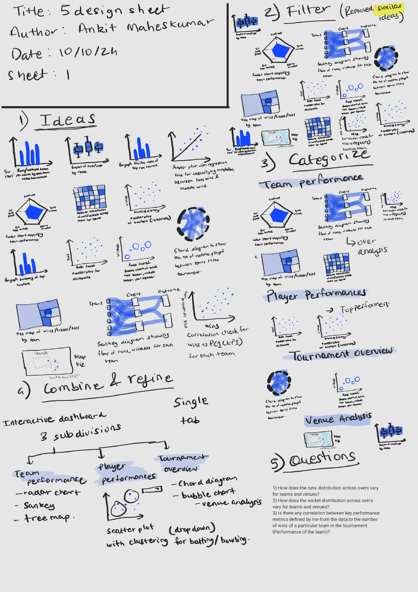
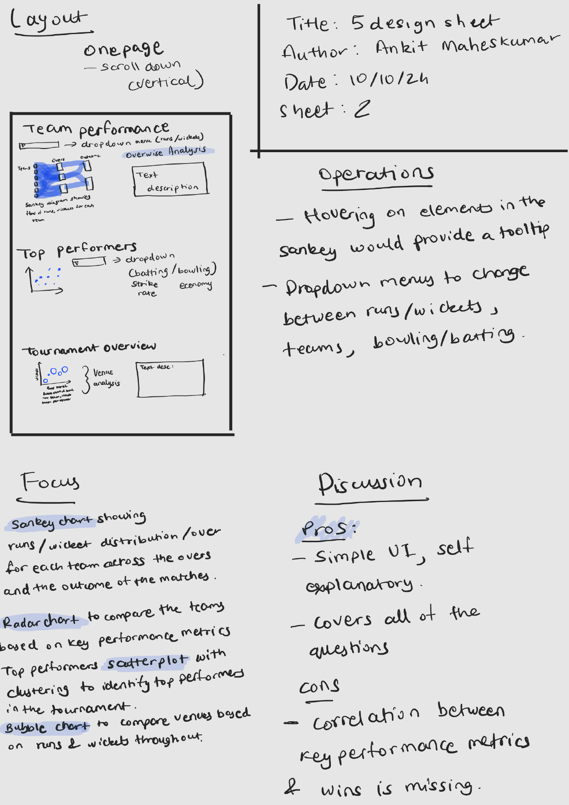
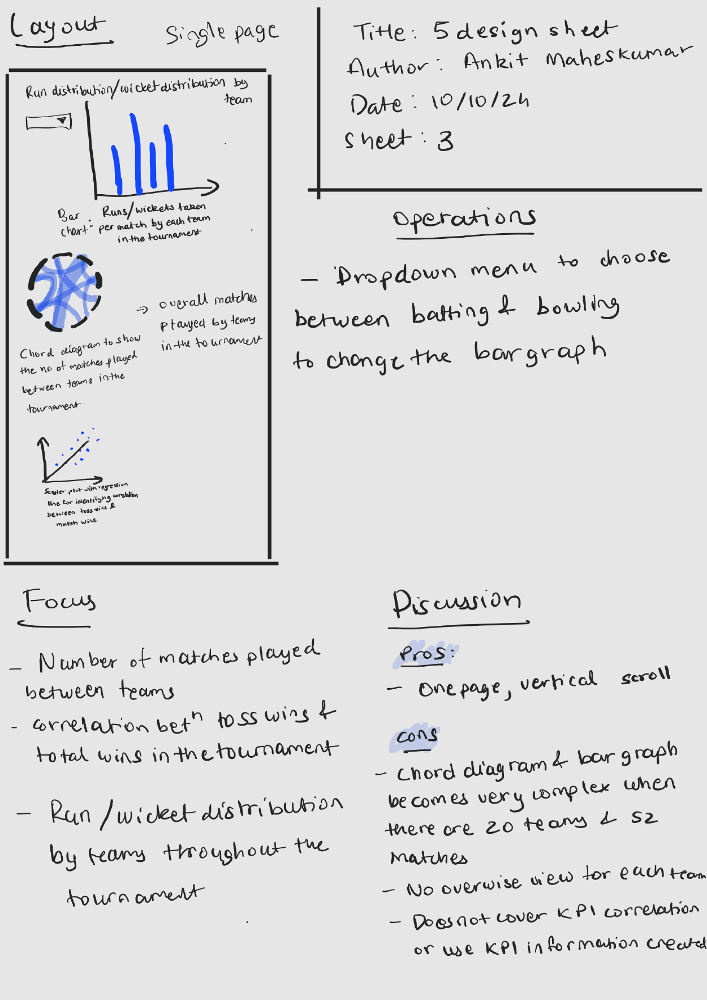
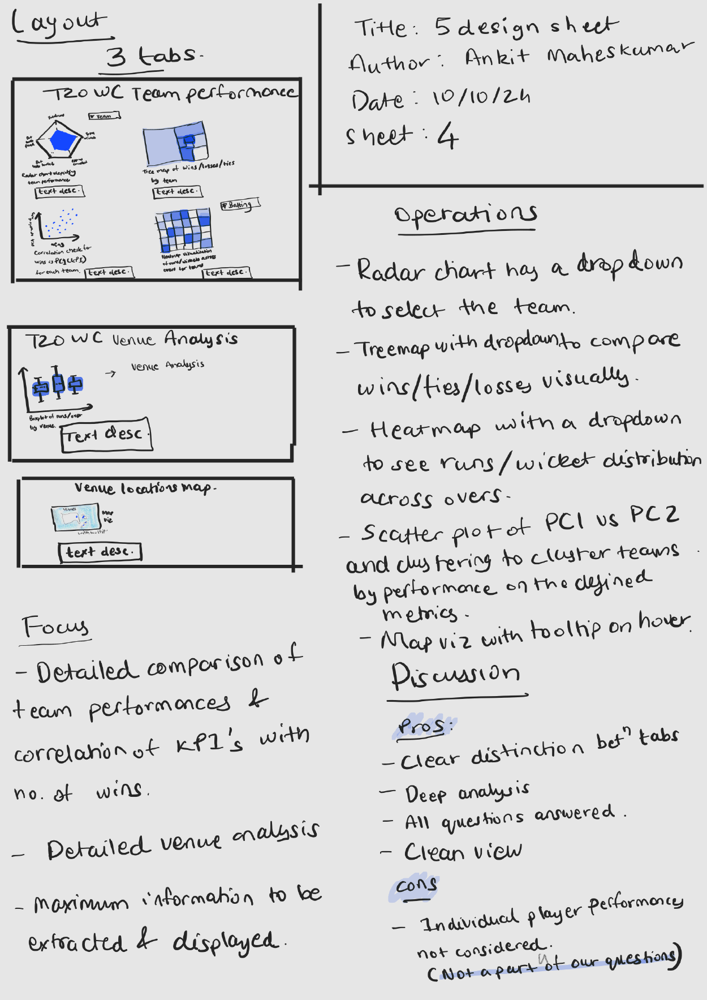
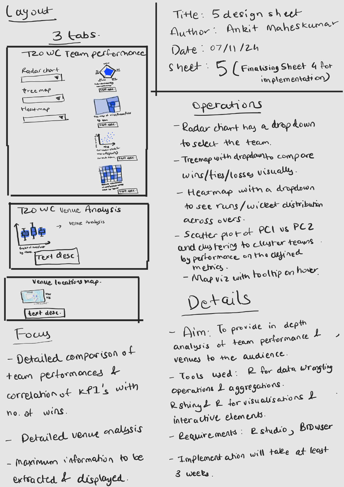

# ICC T20 World Cup 2024 Data Visualisation (R)

A data visualisation / analytics project built in **R** using ball-by-ball and match-level IPL data.

Highlights:
- Feature engineering and KPI aggregation (runs, wickets, dot balls, extras, boundaries)
- PCA on team performance KPIs
- Visual analysis with ggplot2
- Chord diagram exploration of team matchups

## Dashboard screenshots

These are screenshots of the final Tableau dashboard/views.







## Design process (Sheets 1–5)

These pages show the design sheet process used to decide layout and visual choices.







## How to run

```bash
# from repo root
R -q -e "rmarkdown::render('report/DVP_static_viz.Rmd', output_file='index.html', output_dir='docs')"
```

The rendered HTML will be at: `docs/index.html`

## Repo structure
- `report/` – RMarkdown analysis
- `data/` – datasets used (CSV)
- `docs/` – rendered HTML output
- `docs/screenshots/` – screenshots for GitHub README
- `outputs/` – precomputed intermediate .rds files

## License
MIT
